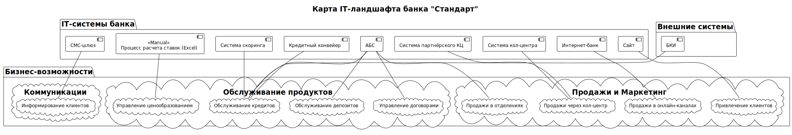
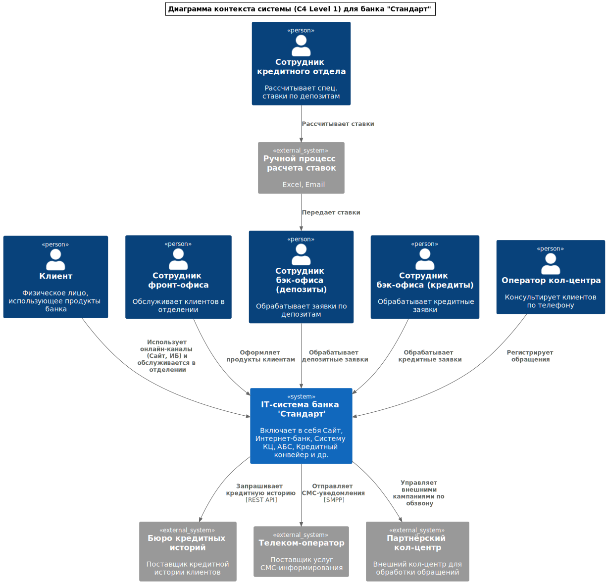
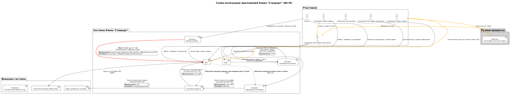
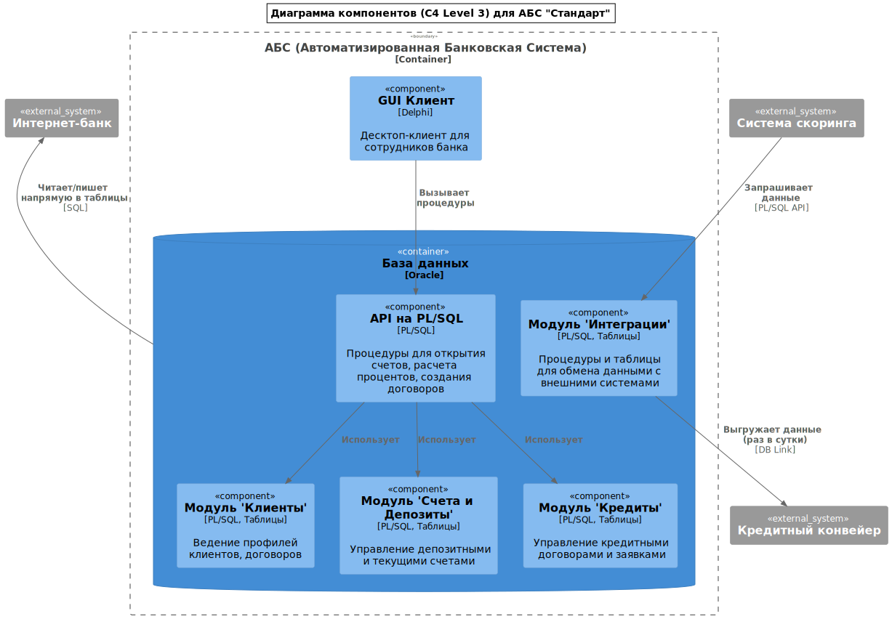
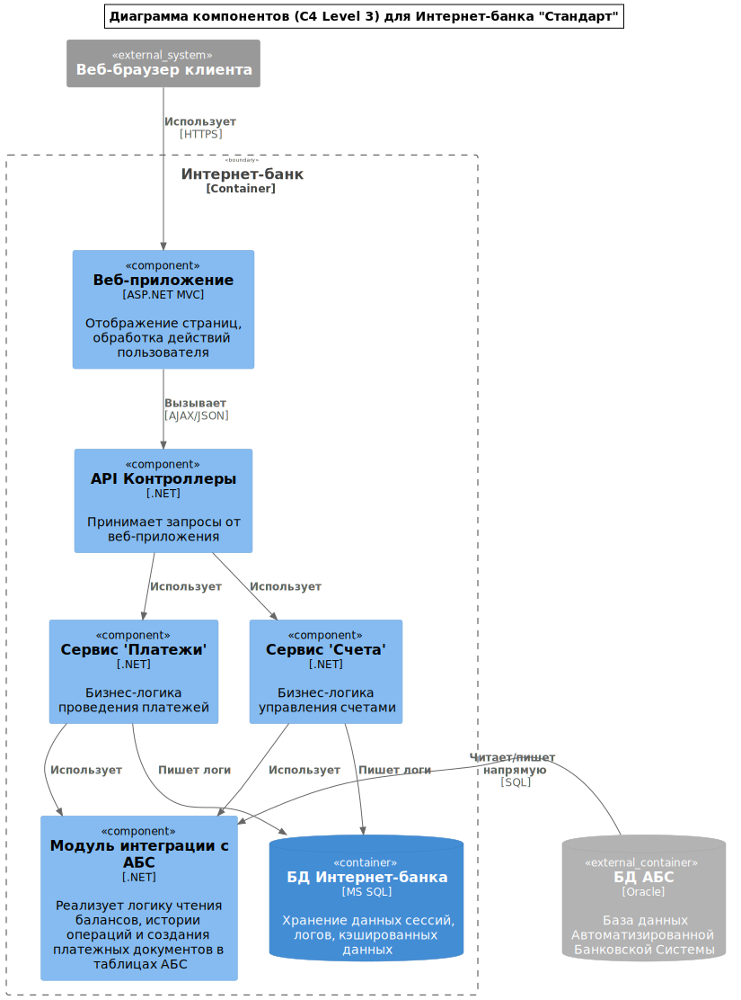
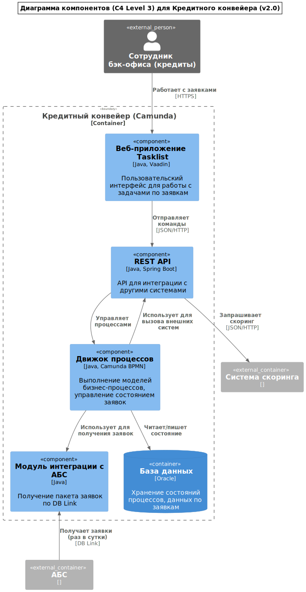
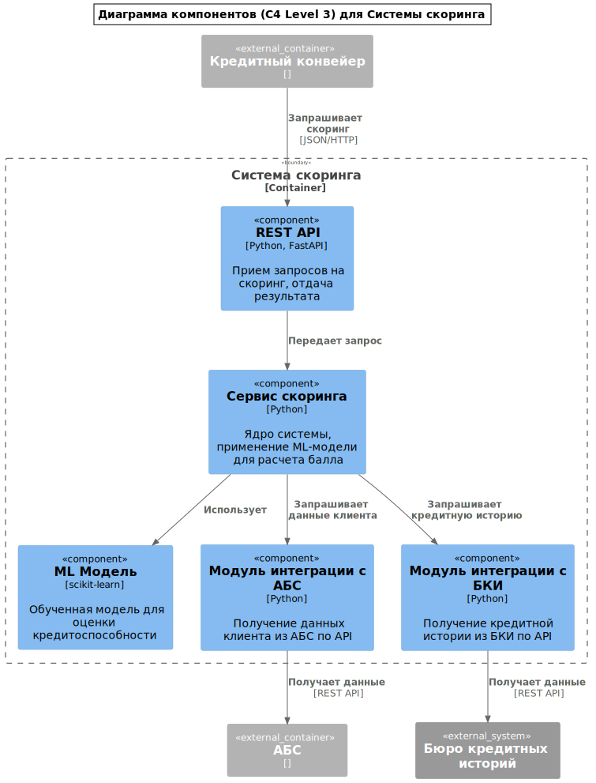
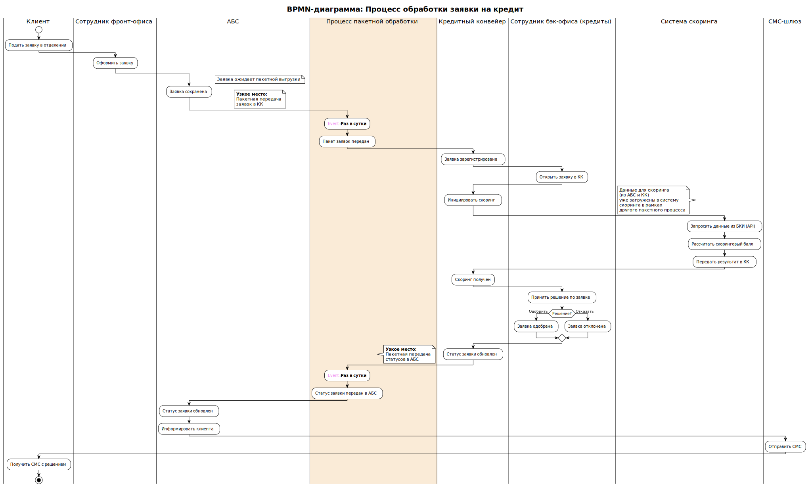
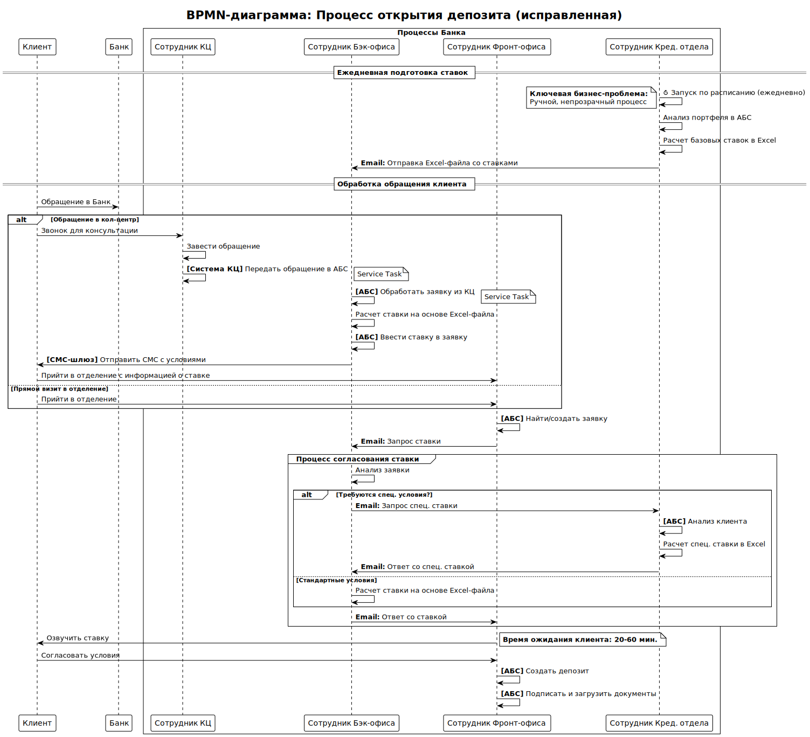

# Архитектурное описание системы (AS-IS)

Этот набор документов предоставляет комплексное, многоуровневое представление о текущей архитектуре банка "Стандарт". Артефакты выстроены по принципу "от общего к частному" и дополняют друг друга.

### 1. [Глоссарий](Glossary.md)

*   **Отвечает на вопрос:** *Что означают эти термины?*
*   **Описание:** Ключевые термины, используемые в архитектурной документации.

### 2. [Карта бизнес-возможностей](Business_Capability_Map.md)

*   **Отвечает на вопрос:** *Что делает бизнес?*
*   **Описание:** Это верхнеуровневая, стабильная модель того, из каких фундаментальных блоков состоит деятельность банка.

### 3. [Портфель приложений](Application_Portfolio.md)

*   **Отвечает на вопрос:** *Какие IT-системы реализуют бизнес-возможности?*
*   **Описание:** Этот документ связывает абстрактные бизнес-возможности с конкретными IT-системами.

### 4. [Карта IT-ландшафта](IT_Landscape.puml)

*   **Отвечает на вопрос:** *Какие подразделения и какие IT-системы отвечают за конкретные бизнес-возможности?*
*   **Описание:** Матрица, сопоставляющая орг. структуру, IT-системы и бизнес-возможности.

### 5. Архитектура C4

#### [Уровень 1: Контекст системы](C4_Context.puml)
*   **Отвечает на вопрос:** *Кто и как взаимодействует с нашей системой?*
*   **Описание:** Высокоуровневый взгляд на систему, ее пользователей и внешние зависимости.

#### [Уровень 2: Схема интеграции (Контейнеры)](Integration_diagram.puml)

*   **Отвечает на вопрос:** *Как именно системы связаны между собой?*
*   **Описание:** Углубляясь в детали, эта схема показывает технические связи, протоколы, риски и аспекты безопасности для каждой интеграции.

#### [Уровень 3: Компоненты](C4_Components_ABS.puml)
*   **Отвечает на вопрос:** *Из чего состоят ключевые контейнеры?*
*   **Описание:** Детальная схема компонентов для ключевых систем.

### 6. Бизнес-процессы (BPMN)

#### [Процесс обработки кредита](Credit_Process_BPMN.puml)

*   **Отвечает на вопрос:** *Как системы и люди взаимодействуют во времени для получения кредита?*
*   **Описание:** Эта диаграмма иллюстрирует динамику кредитного процесса.

#### [Процесс открытия депозита](Deposit_Process_BPMN.puml)

*   **Отвечает на вопрос:** *Как системы и люди взаимодействуют во времени для открытия депозита?*
*   **Описание:** Эта диаграмма иллюстрирует динамику депозитного процесса.

