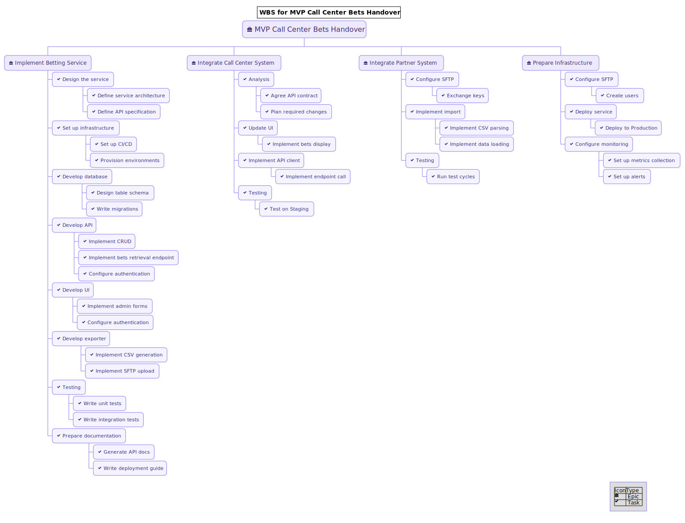
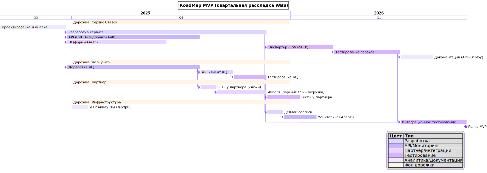

# Задание 4: Передача ставок в кол-центр

## Архитектурное решение

Подробное описание архитектурного решения задокументировано в [ADR-002: Централизованное управление ставками и их передача в кол-центры](ADR-002-Rates-Integration.md).

## WBS (Work Breakdown Structure)

## Roadmap

